# Sovjetski digitalni računar АЦВМ М-1

Razvoj računarstva danas je neraskidivo vezan za tzv. "zapadni svet", labavi geografski termin koji obuhvata Sjedinjene Američke Države, članice nekadašnjih Evropskih zajednica, kao i Britanski Komonvelt nacija. Zaista, već tokom Drugog svetskog rata pojedine članice ove grupe usmerile su značajne naučne i materijalne resurse na razvoj računara, pre svega kao deo ukupnih ratnih napora - u prilog ovoj tvrdnji dovoljno je spomenuti Kolosa (_Colossus_) iz Blečli parka (_Bletchley Park_) koji su koristili dešifranti Enigme, i ENIAC koji je svoj doprinos dao razvoju atomskih bombi bačenih na Japan u avgustu 1945. godine.

Uprkos veličini takvog poduhvata, izdvajanje tolikih materijalnih i ljudskih resursa nije bilo nepremostiv problem za zapadne države, budući da se rat na većini njihovih teritorija nije ni vodio, dok je sa druge strane već postojala istraživačko-proizvođačka osnova iz predratnih godina koju je bilo moguće iskoristiti za izgradnju računara već tokom rata.

Nažalost, ime Saveza sovjetskih socijalističkih republika sinonimno je sa ratnim stradanjima - junačka država izgubila je oko 27 miliona ljudi, pored toga što je razvijeni zapad zemlje bio najteže pogođen divljanjem nacističke soldateske. Naravno, ironijom sudbine SSSR je, nalik Trećem rajhu, još pre rata eliminisao određeni broj pripadnika naučne i vojne elite, te je time situacija kada je mir nastupio u septembru 1945. bila veoma teška.

Ipak, ruska tradicija koja seže još u carsko doba iznedrila je veliki broj vrhunskih svetskih matematičara, fizičara i inženjera različitih profila, od kojih su većina bili plodni pisci. Na taj način postojala je osnova da se zemlja oslobođena ratnog bremena uvede u računarsko doba, i upravo tog zadatka se latilo mlado pokolenje poletnih stvaralaca, ne zaostajući time nimalo za uspesima ratom gotovo neokrnjenog zapadnog sveta.

## 1 Analogni računari u predratnom Sovjetskom savezu

Istorija izračunavanja korišćenjem različitih uređaja u Sovjetskom savezu počinje pre drugog svetskog rata sa izgradnjom neobičnih analognih hidrauličnih računara. Metoda hidrauličnih analogija i odgovarajući uređaji počeli su da se primenjuju u SSSR-u i SAD praktično istovremeno.

U Sovjetskom savezu hidrointegrator je razvio Vladimir Sergejević Lukjanov (_Владимир Сергеевич Лукьянов_) 1936. godine za proučavanje mehanizma nastanka temperaturnih pukotina u betonu pri izgradnji nosača železničkog mosta. Nakon toga, dizajn analognog uređaja se stalno usavršavao i Lukjanovljev hidrointegrator je postao jedan od prvih računara koji je serijski proizveden (1955). Studije su pokazale da se do pojave računara metod hidrauličnih analogija uspešno koristio u proučavanju različitih tehnoloških i prirodnih procesa.

U Sjedinjenim Državama, patent za uređaj koji koristi metodu hidrauličnih analogija i koji je bio namenjen proučavanju termičkih procesa, hidrokal (eng. _hydrocal_), izdat je Arturu Muru (_Arthur Moore_) 1937. godine. Međutim, zbog brojnih nedostataka u dizajnu, Murov uređaj nije bio široko primenljiv za rešavanje inženjerskih problema. [[1]](#1)

Izbijanje Velikog otadžbinskog rata[^1] preusmerilo je sva sredstva na ratne napore velike države, te je bilo kakav naučno-istraživački rad morao sačekati dolazak mira.

## 2 Automatski digitalni računar M-1

Istorija sovjetskog, a kasnije i ruskog računarstva u onom vidu u kakvom ga poznajemo danas počinje krajem 1940-ih godina XX veka, kada su Isak Semjonović Bruk (_Исаак Семенович Брук_) i Sergej Aleksejević Lebedev (_Сергей Алексеевич Лебедев_), nezavisno od zapadnih naučnika a dobrim delom i jedan od drugog, razvili osnovne principe arhitekture elektronskih digitalnih računara. U nastavku rada biće reči o radu Bruka koji se tek nešto pre Lebedeva ovenčao uspehom.

Već u prvim posleratnim godinama dolazi do naglog razvoja računarstva u Sovjetskom savezu. Isak Bruk i Bašir Iskandarović Ramejev (_Рамеев Башир Искандарович_), čiji je patent za automatski digitalni računar (rus. _автоматическая цифровая вычислительная машина_) zaveden pod brojem 10475 4. decembra 1948. godine, smatraju se rodonačelnicima sovjetske informatike. Rezultat rada dvojice naučnika bio je automatski digitalni računar M-1 (_АЦВМ М-1_), prvi u seriji računara koji će se proizvoditi u SSSR-u sve do kraja osamdesetih godina XX veka. [[2]](#2)

### 2.1 Ideja i patent

Isak Bruk rođen je 27. oktobra 1902. godine u radničkoj porodici u gradu Minsku. Godine 1920. upisuje Moskovksu višu tehničku školu "Nikolaj Ernestović Bauman" (_Московское высшее техническое училище им. Н. Э. Баумана_ - _МВТУ_, danas je to Moskovski državni tehnički univerzitet "Nikolaj Ernestović Bauman", _Московский государственный технический университет им. Н. Э. Баумана_ - _МГТУ_), na kojoj diplomira radom na temu regulacije asinhronih motora u kaskadnom kolu. Maja 1925. godine zapošljava se u Državnom eksperimentalnom elektrotehničkom institutu, ali zaposlenje prekida u periodu od septembra 1925. do maja 1926. godine radi službe u Crvenoj armiji. Nakon službe se vraća na staro radno mesto u funkciji rukovodioca grupe mašinskog i hardverskog odelenja Svesaveznog instituta energetike (_Всесоюзный энергетический институт_). Akademsku karijeru gradi u periodu od 1935. do 1956. godine kao istraživač i kasnije rukovodilac laboratorije energetskih sistema Energetskog instituta Akademija nauka SSSR "Gljeb Maksimilijanović Kšižanovski" (_Глеб Максимилианович Кржижановский_). [[3]](#3)

	<figure>
	    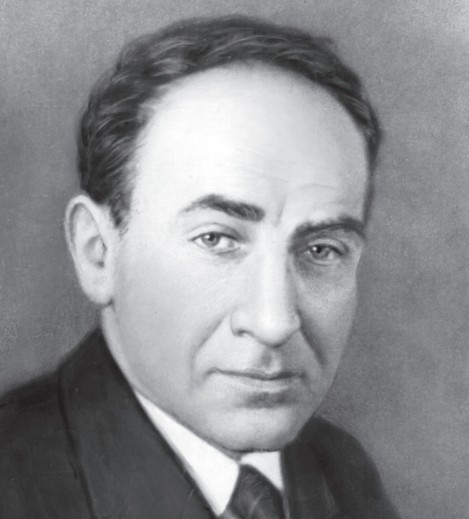
	    <figcaption>Slika 1. Isak Semjonović Bruk (<em>Исаак Семенович Брук</em>). <a href="#3">[3]</a></figcaption>
	</figure>

Bašir Ramejev rođen je 1. maja 1918. godine u porodici rudarskog inženjera u selu Bajmak Orenburške gubernije Ruskog carstva. Potiče iz porodice intelektualaca, budući da je Baširov deda po sa očeve strane u carsko doba bio ne samo imućan zlatar nego i pesnik, već tada priznat klasikom tatarske književnosti. Kao bogatom intelektualcu Ramejevu starijem je za vreme Crvenog terora prisvojena etiketa "neprijatelja naroda", da bi 1938. godine za vreme Staljinovih čistki bio uhapšen i osuđen na pet godina radnog logora, gde je naposletku 1943. godine i umro. Ne iznenađuje da Bašir Ramejev nije bio pošteđen maltretiranja, te je mladić 1938. godine ispisan sa fakulteta i još dugo potom ostao bez formalne potvrde o visokom obrazovanju. On ipak uspeva da se zaposli na Centralnom naučno-istraživačkom institutu za vezu 1940. godine, da bi odatle otišao kao dobrovoljac vezista u bataljon Ministarstva za vezu SSSR po izbijanju Velikog otadžbinskog rata. Nakon učestvovanja u operacijama na Dnjepru i u Kijevu u sklopu Prvog ukrajinskog fronta, službe je oslobođen 1944. godine kako bi učestvovao u naporima obnove narodne privrede. Početkom 1947. godine Ramejev saznaje za računar ENIAC izgrađen u SAD i odlučuje se za novu i uzbudljivu naučno-tehničku oblast računarstva. Po preporukama svog rukovodiaca Aksela Ivanovića Berga (_Аксель Иванович Берг_) obraća se dopisnom članu Akademija nauka SSSR-a Isaku Bruku i u maju 1948. godine biva primljen u Laboratoriju elektrosistema Istituta za energetiku Akademije nauka SSSR-a kao inženjer-konstruktor. [[4]](#4)

	<figure>
	    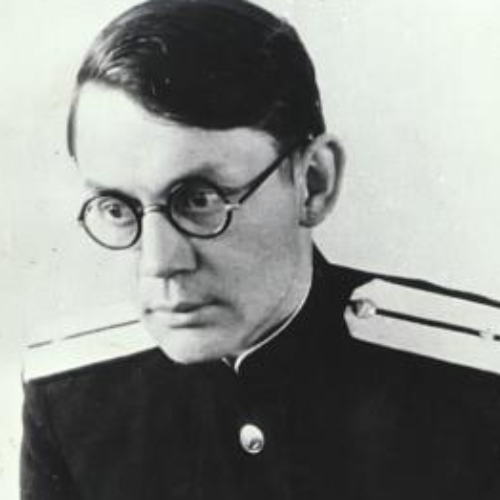
	    <figcaption>Slika 2. Bašir Iskandarović Ramejev (<em>Рамеев Башир Искандарович</em>). <a href="#4">[4]</a></figcaption>
	</figure>

Iako se predmet njegovog profesionalnog interesovanja u početku nije obuhvatao računarstvo, Isak Bruk se ka konstrukciji automatskog digitalnog računara M-1 kretao dosledno i sa zavidnom koncentracijom. Kao rukovodilac laboratorije energetskih sistema započeo je istraživanja proračuna režima rada moćnih elektroenergetskih sistema i njihove statičke stabilnosti, proučavanje pitanja kompenzacije reaktivne snage dalekovoda i raznim drugim problemima elektroprivrede. Kao alat za ovu namenu u laboratoriji nastaje svojevrstan mehanički računar specijalizovan za proračun naizmenične struje pri modelovanju složenih električnih mreža. Rad u ovom pravcu Bruk nastavlja 1936. godine kada izrađuje mehanički instrument za rešavanje običnih diferencijalnih jednačina, a nakon toga 1939. godine kada je razvijen, izrađen i u Energetski institut "Kšižanovski" postavljen mehanički integrator, koji je mogao da rešava diferencijalne jednačine do šestog reda. Ovakav integrator se prema savremenoj klasifikaciji prepoznaje kao analogni računar.

Isak Bruk nastavlja svoja istraživanja nakon službe u Velikom otadžbinskom ratu. Godine 1946. izrađuje mehanički instrument za približnog rešenja diferencijalnih jednačina Poasona (_Siméon Denis Poisson_) i Laplasa (_Pierre-Simon Laplace_). Ipak, Bruk je bio svestan velikih i konstantno rastućih mogućnosti radioelektronike. Nedugo zatim u laboratoriji je razvijen i izrađen elektronski diferencijalni analizator, koji je predstavljao analogni računar namenjen integriranju jednačina do dvadesetog reda, a ujedno i Brukov prvi susret sa praktičnom upotrebom radioelektronike. [[3]](#3)

### 2.2 Projekat i razvoj

Leta 1948. godine Isak Bruk prima inženjera Bašira Ramejeva kao inženjera-konstruktora u laboratoriju Instituta "Kšižanovski". Već u avgustu dva naučnika uspevaju da razrade projekat digitalnog elektronskog računara, koji krajem te iste godine upućuju u Državni komitet Saveta ministara SSSR-a za uvođenje naprednih tehnologija u narodnu privredu, zajedno sa više od deset pratećih prijava za razvoj i izradu sastavnih delova takve mašine. Množitelj brojeva u binarnom sistemu, neprekidni sabirač, uređaj za pretvaranje binarnih brojeva u dekadni sistem, množilac sa dvorednim brojačima, elektronski numerički integrator, automatski digitalni računar, jednocifreni sabirač binarnih brojeva, relejno-kodni množitelj, množilac za istovremeno množenje više brojeva u binarnom sistemu, sabirač za istovremeno sabiranje više brojeva u binarnom sistemu - ukupno deset projekata bilo je odobreno od strane komiteta.

Sam računar se u projektnoj dokumentaciji opisuje kao "automatski digitalni računar brzog dejstva i opšte primene", a kao željene karakteristike se, između ostalih, navodi sledeće:

-   glavni softverski senzor mašine se pokreće na početku svakog ciklusa start signalom i uključuje pojedine elemente mašine u skladu sa programom za rešavanje problema, koji zatim rade autonomno jedan ciklus,
-   primenjuje se relejno-kodni princip rada sa istovremenim prenosom svih cifara broja u svim elementima mašine,
-   pomoćni računar se koristi sa nekoliko fiksnih programa snimljenih na kontinuirano rotirajućim dobošima za interpolaciju i obavljanje računskih operacija koje se često ponavljaju,
-   koriste se poseban sabirač, množilac i delilac, izrađeni prema aplikacijama br. 381421- IV, br. 381433-IV, br. 381478-IV, br. 364301-IV, br. 364298,
-   za kontrolu rada mašine koriste se dekoderi binarnog koda, izrađeni prema aplikacijama br. 363668-III, br. 363665-III. [[3]](#3)

	<figure>
	    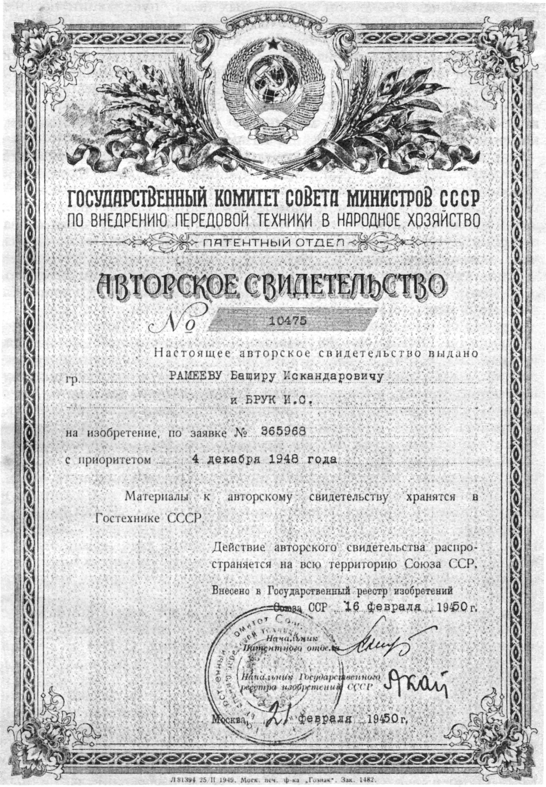
	    <figcaption>Slika 3. Patent Bruka i Ramejeva br. 10475 od 4. decembra 1948. godine. <a href="#3">[3]</a></figcaption>
	</figure>

U odgovoru Državnog komiteta se između ostalog navodi sledeće:

> Automatski digitalni računar za obavljanje aritmetičkih operacija nad brojevima predstavljenim u binarnom brojevnom sistemu, sa primenom preliminarnog snimanja ulaznih numeričkih podataka i plana za rešavanje zadatka na programskoj traci, sa primenom glavnog softverskog senzora koji se kontroliše podacima sačuvanim na navedenoj programskoj traci i koji raspodeljuje ulazne numeričke podatke među pojedinim komponentama uređaja u skladu sa planom rešenja, sa primenom elektronskih ili drugih uređaja prilagođenih za obavljanje aritmetičkih operacija u binarnom brojevnom sistemu, sa primenom ventilskih uređaja ovog ili drugog tipa, koje kontroliše pomenuti glavni softverski senzor, i koji su namenjeni za ulaz ili izlaz digitalnih vrednosti u čvorovima uređaja, sa primenom elektronskih ili drugih uređaja za skladištenje prilagođenih za čuvanje numeričkih podataka tokom određenog vremena, sa primenom pomoćnog digitalnog računara sa fiksnim radnim programom za interpolaciju tabelarnih digitalnih podataka, sa primenom izlaznih uređaja koji evidentiraju brojeve dobijene tokom rada u binarnom sistemu uz naknadnu transformaciju pomenutih brojeva u dekadni sistem i štampanje na papiru, koji se odlikuje time što se glavni programski senzor mašine pokreće na početku svakog radnog ciklusa startnim signalom i okreće na, u skladu sa programom, pojedinim komponentama mašine, koje zatim autonomno rade jedan ciklus. [[5]](#5)

Početkom 1950. godine Isak Bruk se obraća Prezidijumu Akademija nauka SSSR-a sa predlogom da se u plan rada laboratorije elektrosistema uključi izgradnja automatskog digitalnog računara M-1. Predlog je prihvaćen i po nalogu prezidijuma od 22. aprila 1950. godine laboratorija dobija finansijska sredstva i dodatne specijaliste neophodne za rad na računaru M-1. [[3]](#3)

	<figure>
	    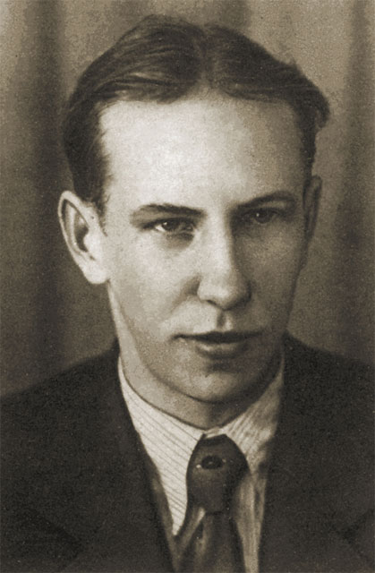
	    <figcaption>Slika 4. Nikolaj Jakovljević Matjuhin (<em>Николай Яковлевич Матюхин</em>). <a href="#3">[3]</a></figcaption>
	</figure>

Nedugo zatim Bruku se pridružuje diplomac radiotehničkog fakulteta Moskovskog istituta energetike (_Московский энергетический институт_, skraćeno _МЭИ_) Nikolaj Jakovljević Matjuhin (_Николай Яковлевич Матюхин_) u svojstvu mlađeg naučnog saradnika. Matjuhin se ubrzo pokazao kao dostojan poverenog mu zadatka, budući da uspeva da prilično brzo usvoji ideju i osnovne principe na kojima počiva izgradnja električnih računara. Matjuhin započinje rad na M-1 razvojem logičke sheme troulaznog sabirača i opštog kola aritmetičke jedinice. [[3]](#3)

	<figure>
	    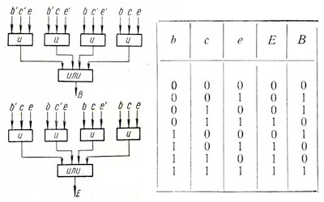
	    <figcaption>Slika 5. Logička shema i istinitosna tablica troulaznog sabirača računara M-1. Oznake <em>b</em> i <em>c</em> predstavljaju izlaze okidača sabiraka, dok oznaka <em>e</em> označava izlaz okidača prelazne jedinice. Logička kola označena su kurzivnim ćiriličnim <em>и</em> (AND) i <em>или</em> (OR). <a href="#3">[3]</a></figcaption>
	</figure>

Svaka digitalna cifra aritmetičke jedinice sadržala je binarni sabirač sa tri ulaza, četiri okidača numeričkih registra izgrađenih na radio cevima 6Н8С [^2] (dva registra sabiraka, registar prelazne jedinice i registar pomeranja) i prijemni okidač digitalne magistrale izgrađen na osnovi dve 6П6 vakuumske cevi. Na taj način je svaka od cifara sadržala 22 vakuumske cevi, od kojih se 16 (reč je o 6Х6 diodama) koristilo pri izgradnji logičke sheme.

Početkom juna 1950. godine je izgrađena umanjena maketa računara prema električnoj shemi aritmetičke jedinice koju je razvio Nikolaj Matjuhin. Dimenzije makete ukazivale su na gigantske razmere budućeg uređaja koji je bio toliko impozantan da se Laboratorija elektrosistema mogla naći u problemu pri njegovom razmeštanju.

Pošto se većina vakuumskih cevi koristila za konstruisanje logičkih kola, Bruk je predložio da se sprovede istraživanje o mogućnosti korišćenja poluprovodničkih uređaja u dekoderima i mikserima, imajući pri tom u vidu КВМП-2-7, ispravljače od bakar-oksida malog gabarita. Projektu se tada priključuje Jurij Vasiljević Rogačov (_Рогачёв Юрий Васильевич_), koji je na osnovu podataka sopstvenih statističkih istraživanja tehničkih parametara velikog broja takvih ispravljača ukazao na stabilnost njihovih tehničkih karakteristika. Reč je konkretno o odnosu direktnog i obratnog otpora, vrednosti kojih kod КВМП-2-7 iznose 3-5 kΩ, odnosno 0,5-2 MΩ - ukoliko je odnos ove dve vrednosti najmanje 1:100 komponenta je u stanju da pouzdano obezbedi ispunjavanje diodnih funkcija u logičkim shemama. Uzimajući ove parametre u obzir, proračunato je električno kolo sabirača i napravljen model aritmetičke jedinice, koja je po funkcionalnoj shemi identična sabiraču na osnovi vakumskih cevi. [[3]](#3)

Razlog odluke da se vakuumske cevi zamene poluprovodničkim komponentama je trojak: opšta posleratna nestašica najrazličitijih materijala i komponenti zajedno sa željom da se smanji ukupna količina električne energije koju bi uređaj trošio bili su jedna strana medalje, dok je druga svakako obilje elektronske i radio opreme koju je sovjetska vojska donela iz Nemačke kao ratni plen. Upravo naziv bakar-oksidnih ispravljaća odomaćen u sovjetskoj literaturi - "kuproksni" ispravljači - ukazuje na nemačko poreklo (_Kupferoxydul Gleichrichter_). Uprkos pojedinim navodima da su ovakvi ispravljači u SSSR-u po prvi put nezavisno proizvedeni već 1935. godine u Nižnjem Novgorodu, sve činjenice ukazuju na to da su prve komponente ovog tipa u Sovjetskom savezu nastale kopiranjem Siemens-ovih SIRUTOR ispravljača. [[6]](#6)

Proučavanje makete računara u statičkom režimu pouzdano je pokazalo ispravne rezultate operacije sabiranja za sve moguće kombinacije ulaznih podataka. Sledilo je utvrđivanje mogućnosti njihovog korišćenja u impulsnim kolima. Eksperimentalne studije prototipa u impulsnom režimu takođe su pokazale njegov stabilan rad u širokom frekventnom opsegu. Stabilnost rada kola je određena uzimajući u obzir odstupanja nivoa napona napajanja i varijacije u parametrima komponenti. Posebna pažnja je posvećena stabilnosti i pouzdanosti samih bakar-oksidnih ispravljača.

Već u avgustu 1950. godine postaje jasno da kolo funkioniše pouzdano i da ispravljači na bazi bakar-oksida stabilno obavljaju logičke funkcije dioda. Završna ispitivanja ovog prototipa su sprovedena uz direktno učešće Isaka Bruka, tokom kojih su sprovedeni testovi potvrdili pouzdan rad logičkih kola izgrađenih na bazi minijaturnih bakar-oksidnih ispravljača. Na osnovu rezultata ovih ispitivanja, Bruk je doneo konačnu odluku da napravi logička kola mašine M-1 koristeći poluprovodničke uređaje КВМП-2-7. Komentarišući ovu odluku, Isak Bruk je, ne skrivajući emocije oduševljeno izjavio: "Ovo je revolucionaran korak, pravi trijumf! To je prvi korak, koji će otvoriti put ka tome da svaki inženjer na svom radnom stolu ima računar!..."

Nikolaj Matjuhin se u svojim memoarima na ovu odluku osvrnuo sledećim rečima: "Jedna od osnovnih odluka koja je, čini mi se, predodredila uspeh našeg prvog uređaja i omogućila njegovu izgradnju za tako kratko vreme, bio je pravac kojim je krenuo Bruk opredelivši se za korišćenje poluprovodničkih elemenata. U to vreme takvi elementi bili su prisutni u našoj industriji samo u vidu malogabaritnih bakar-oksidnim ispravljačima koji su se proizvodili za potrebe merne tehnike. Bruk je napravio dogovor o proizvodnji posebne modifikacije takvog ispravljača dimenzija običnog otpornika, dok smo mi napravili skup standardnih kola. U radionici pri laboratoriji počelo se sa proizvodnjom i ugradnjom blokova, a za manje od godinu dana mašina je već 'prodisala'. U uređaj je ugrađeno nekoliko hiljada bakar-oksidnih ispravljača i svega nekoliko stotina vakuumskih cevi. Na taj način je M-1 postao prvi u svetu digitalni računar u kome su logička kola bila izgrađena na osnovi poluprovodničkih komponenti. Primena bakar-oksidnih ispravljača umesto vakuumskih cevi je takođe značajno smanjila razmere uređaja čime su ublaženi zahtevi kada je reč o prostoru neophodnom za razmeštanju računara (za koji je bila odvojena jedna iz prostorija površine 15m2), te smanjena neophodna jačina električne energije potrebna za rad uređaja što je automatski poboljšalo i temperaturni režim, smanjilo obim radova pri izradi računara, a samim tim i rokove izrade."

Septembra 1950. godine grupa angažovana oko izrade M-1 proširena je diplomcima i studentima završnih kurseva Moskovskog istituta energetike, od kojih su se kasnije kao naučnici i istraživači istakli Tamara Aleksandridi (_Тамара Миновна Александриди_) i Mihail Aleksandrović Karcev (_Михаил Александрович Карцев_, rukovodilac grupe koja će biti odgovorna za razvoj i izradu računara M-2). [[3]](#3)

	<figure>
	    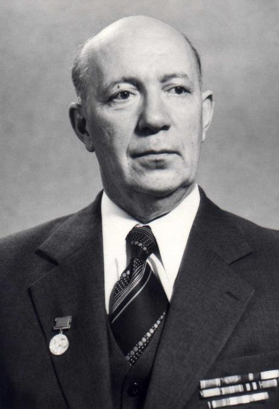
	    <figcaption>Slika 6. Mihail Aleksandrović Karcev (<em>Михаил Александрович Карцев</em>). <a href="#3">[3]</a></figcaption>
	</figure>

U ovom trenutku jasno su definisana lica odgovorna za pojedinačne delove računara i njegovih komponenti. Opšte rukovodstvo razvojem bilo je povereno Nikolaju Matjuhinu. Razvojem aritmetičke jedinice i elementne osnove bavili su se Matjuhin i Jurij Rogačov, razvoj glavnog softverskog senzora bio je poveren Karcevu i Šidlovskom, jednom od novih saradnika laboratorije. Konstrukcija magnetnog doboša pod tehničkim rukovodstvom Isaka Bruka projektovao je konstruktor Kokalevski (_И. А. Кокалевский_), a elektronska kola magnetne memorije Matjuhin i Žurkin (_Л. М. Журкин_). Tamara Aleksandridi je u svojstvu teme diplomskog projekta dobila zadatak razvoja elektronske memorije na elektrostatičkim cevima. Konačno, Zalkind (_А. Б. Залкинд_) i specijalista za telegrafsku opremu Jermočenkov (_Д. У. Ермоченков_) razradili su shemu povezivanja predajnika i teletajpa širokog formata sa aritmetičkom jedinicom. [[3]](#3)

### 2.3 Arhitektura i izrada

U ovom periodu pod naučnim rukovodstvom Isaka Bruka, a uz učešće Nikolaja Matjuhina i Mihaila Karceva, otpočeo je tehnički razvoj arhitekture mašine. Bruk je u ovaj poduhvat dodatno uključio i matematičara Julija Anatoljevića Šrejdera (_Юлий Анатольевич Шрейдер_), a periodično je u radu grupe učestvovao i matematičar i akademik Sergej Ljvović Soboljev (_Сергей Львович Соболев_). Grupa naučnika je u ovom sastavu sprovela detaljno istraživanje algoritama za rešavanje različitih zadataka, koji su doveli do odluke da se u računaru koristi dvoadresni sistem komandi, na osnovu koje je i izrađen tehnički projekat. Mašina je obuhvatala aritmetičku jedinicu (_арифметический узел_, oznaka _АУ_ na slici 7), glavni softverski senzor (_главный программный датчик_, oznaka _ГПД_), internu memoriju dva tipa - elektronsku (_электронная память_, oznaka _ЭП_) i magnetnu (_магнитная память_, oznaka _МП_), i ulazno-izlaznu jedinicu (_узел ввода/вывода_, oznaka _УВВ_). [[3]](#3)

	<figure>
	    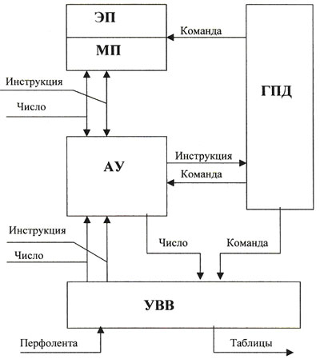
	    <figcaption>Slika 7. Blok-shema računara M-1. Prevod termina: <em>инструкция</em> - instrukcija, <em>число</em> - broj, <em>команда</em> - komanda, <em>перфолента</em> - bušena papirna traka, <em>таблицы</em> - tabele. <a href="#3">[3]</a></figcaption>
	</figure>

Aritmetička jedinica je sadržala 24 digitalna bloka, blok znaka broja, blok za izvršavanje sabiranja i oduzimanja, blok za izvršavanje množenja i deljenja i blok za generisanje i pojačavanje impulsa. U sastav glavnog softverskog senzora ulazilo je 12 vrsta blokova: generator takta, startni i sinhronizacioni blok, distributer impulsa, blok za generisanje impulsa, adresni registar, startni registar, izborni registar, registar za poređenje, blok za operacije i kôd, blok ventila, blok za izbor memorije i blok za operacije poređenja. Planirana je izrada dve vrste memorijskih uređaja, i to magnetnog (sa magnetnim dobošem) i elektronskog (koristeći elektrostatičke cevi).

Na osnovu praktičnog iskustva u razvoju novih serija asinhronih motora stečenog tokom rada u Svesaveznom elektrotehničkom institutu "Vladimir Iljić Lenjin" (_Всесоюзный электротехнический институт им. В.И. Ленина_), као i tokom rada na pronalasku sinhronizatora avionskog topa tokom Velikog otadžbinskog rata koji je obezbedio mogućnost pucanja kroz rotirajući propeler, Bruk je 1950. godine doneo odluku da dizajnira magnetni bubanj kao magnetni memorijski uređaj računara M-1. Glavna jedinica ove magnetne memorije bio je rotirajući duraluminijski cilindar prekriven feromagnetnim slojem i magnetnim glavama smeštenim duž generatrise cilindra. Elektronski deo je sadržao generatore impulsa za pisanje, pojačivače za čitanje i ventil za čitanje.

Predviđeno je korišćenje elektrostatičkih cevi za široku primenu kao skladišnih elemenata elektronske memorije. Elektronska memorijska jedinica je uključivala blok od devet elektrostatičkih cevi ЛО-737, kola za horizontalno skeniranje, ventile za čitanje i upisivanje, kola za vertikalno skeniranje, kolo pozadinskog osvetljenja, RF generatore, pojačivače za čitanje i stroboskope.

Ulazno-izlazni čvor izrađen je na osnovi standardne telegrafske opreme, odnosno teletajpa i predajnika. Instrukcije i vrednosti koje je bilo potrebno uneti u memorijske jedinice mašine ukucavale su se perforatorom teletajpa na standardnoj bušenoj traci i pomoću predajnika se uvodile u računar. Ispis digitalnih rezultata vršio se u vidu štampanih tabela na teletajpu širokog formata.

Započet je intenzivan rad na izradi projektne konstruktorske dokumentacije elektronskih jedinica koje su činile blokove računara. Nakon što bi dijagrami bili završeni, predavani su u montažnu radionicu laboratorije na izradu. U sobi posebno namenjenoj razmeštanju M-1 računara izgrađeno je postolje površine oko 4m2, u čijem centru je instalirana pravougaona ventilaciona kolona sa rupama za hlađenje panela. Vazduh je u kolonu upumpavao snažan ventilator razmešten ispod postolja. Na bočnim stranama stuba nalazile su se police namenjene za pričvršćivanje blokova sa elektronskim kolima jedinica. Kako je proizvodnja napredovala, blokovi su postavljeni na svoja redovna mesta u regalima za konfiguraciju i autonomno pristajanje.

Septembra 1950. godine završen je razvoj projektne konstruktorske dokumentacija za blokove lokalnog softverskog senzora [^3] aritmetičke jedinice. Početkom oktobra Mihail Karcev pristupa razvoju glavnog softverskog senzora, i to počevši od njegove blok sheme. U procesu projektovanja ovog uređaja razvijena su specifična kola koja implementiraju fundamentalno novo tehničko rešenje - dvoadresni komandni sistem, koji je kasnije našao široku primenu kako u sovjetskoj, tako i u zapadnoj računarskoj tehnici. Nakon završetka rada na dokumentaciji, montažna šema jedinice predata je instalaterima na proizvodnju.

Rad na projektovanju magnetne memorije je takođe polako privođen kraju. Elektronska kola pisanja i čitanja magnetnih signala bila su zadaća diplomaca Moskovskog instituta energetike Matjuhina i Zalkinda. Korišćenje magnetnih glava kućnih magnetofona rešilo je problem nedostatka namenskih delova, dok su u eksperimentalnom proizvodnom pogonu Instituta energetike Akademije nauka SSSR-a proizvedeni mehanizam i duraluminijumski cilindar za magnetni doboš. Oblaganje površine cilindra feromagnetnim slojem obavili su specijalisti Svesaveznog radiokomiteta (_Всесоюзный комитет по радиовещанию при Народном комиссариате почт и телеграфов СССР_, Svesavezni komitet za radio-difuziju pri Narodnom komesarijatu pošta i telegrafa SSSR-a). [[3]](#3)

	<figure>
	    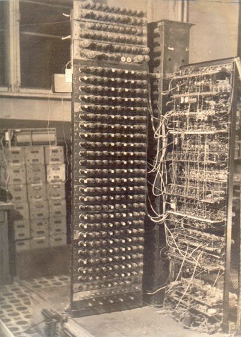
	    <figcaption>Slika 8. Digitalni računar M-1 u martu 1951. godine (pogled sa prednje strane aritmetičke jedinice). <a href="#3">[3]</a></figcaption>
	</figure>

Decembra 1950. godine završena je izrada blokova aritmetičke jedinice i počelo je i montiranje ploča i blokova drugih uređaja. Februara 1951. godine završena je izrada blokova glavnog softverskog senzora, a početkom proleća iste godine izrađena su i priključena elektronska kola i doboš magnetne memorije. Marta 1951. godine sve jedinica bile su u potpunosti opremljene odgovarajućim blokovima. Nastavljena je ugradnja bloka elektronskih memorijskih cevi. Aritmetička jedinica je u tom momentu već bila proverena i izvršavala operaciju sabiranja u automatskom režimu. [[3]](#3)

	<figure>
	    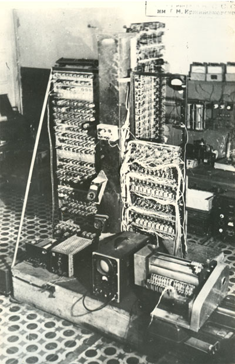
	    <figcaption>Slika 9. Digitalni računar M-1 u martu 1951. godine (pogled sa strane magnetnog doboša). <a href="#3">[3]</a></figcaption>
	</figure>

### 2.4 Ocena i kompletiranje

Početkom aprila 1951. godine rezultati rada na izradi računara M-1 ocenjivala je komisija Prezidijuma Akademije nauka SSSR-a, u čijem sastavu su bili akademici Ivan Pavlović Bardin (_Иван Павлович Бардин_, metalurg), Aleksandar Vasiljević Topčiev (_Александр Васильевич Топчиев_, hemičar), Gljeb Maksimilijanović Kšižanovski, Mihail Aleksejević Lavrentjev (_Михаил Алексеевич Лаврентьев_, matematičar i mehaničar), Sergej Ljvović Soboljev, kao i niz drugih predstavnika Akademije nauka i industrije zemlje.

Demonstracija automatskog rada aritmetičkog uređaja ostavila je ogroman utisak na posetioce. Svetlosna indikacija digitalnih registara vizuelno je pokazivala automatski proces obavljanja operacije sabiranja, što je naročito jako bilo izraženo pri radu uređaja u režimu brojača, kada se jarka svetlost indikatorskih lampica prvih cifara postepeno smanjivala, u srednjim ciframa se pretvarala u treperenje, koje je pri uključivanju svake sledeće cifre postajalo sve ređe i ređe.

Na osnovu rezultata ove posete Prezidijum Akademije nauka SSSR-a je naredbom br. 602 od 16. aprila 1951. godine za uspešan završetak radova po zadatku od 22. aprila 1950. godine nagradio deset vodećih tvoraca mašine. [[3]](#3)

	<figure>
	    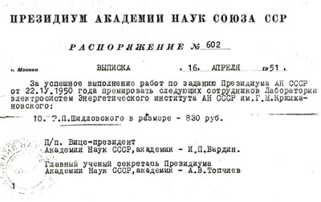
	    <figcaption>Slika 10. Fotokopija rešenja o isplati jedne od nagrada za rad na računaru M-1 od strane Prezidijuma Akademije nauka SSSR-a. <a href="#3">[3]</a></figcaption>
	</figure>

U narednom periodu nastavljena je autonomna konfiguracija preostalih komponenti računara i njihovo delimično spajanje. Na napajanje električnom energijom je priključen magnetni doboš proizveden u probnoj proizvodnji Instituta energetike Akademije nauka SSSR-a. Na posebnom stolu u prostoriji računara postavljen je predajnik i kablovima sa konektorima spojen na stalak mašine, obezbeđujući unos u mašinu početnih podataka i programa za rešavanje zadataka sa bušene papirne trake, kao i teletajp širokog formata na kom su se štampale brojčane tablice sa rezultatima rešenja zadataka. Istovremeno je počeo razvoj testnih programa. Razvijen je komandni sistem i tehnologija programiranja. U ovom poduhvatu učestvovao je mladi matematičar Julijus Šrejder, Mihail Karcev, Nikolaj Matjuhin i niz drugih potencijalnih korisnika računara, uključujući i Sergeja Soboljeva. Svi oni su razvijali programe za rešavanje specifičnih problema na M-1, a takođe i obučavali učesnike razvoja računara kao i buduće korisnike programiranju. Da bi se pratio ispravan rad mašine tokom složenog sklapanja sastavnih komponenti, napisani su programi za rešavanje jednostavnih problema čiji su rezultati relativno lako mogli da se provere. Veoma uspešnim se pokazao program rešavanja jednačine parabole _y = x2_. Identični rezultati rešenja za pozitivne i negativne vrednosti _x_ omogućili su da se utvrdi ispravan rad mašine upoređivanjem ispisa simetričnih vrednosti rešenja. Ovaj program može se smatrati prvim testnim programom računara M-1.

Krajem avgusta 1951. godine započet je proces otklanjanja grešaka na računaru, i to izvođenjem aritmetičkih i logičkih operacija u automatskom režimu. Grupi naučnika su se tom prilikom pridružili Belinski (_В. В. Белынский_) i Pšiemski (_Ю. Б. Пржиемский_). Sveobuhvatno podešavanje i ispitivanje mašine završeno je početkom decembra 1951. rešenjem niza kontrolnih zadataka, uključujući one koje je sastavio Sergej Soboljev. Računar je tada, zajedno sa projektom naučnog izveštaja o završetku radova obavljenih po nalogu Prezidijuma Akademije nauka SSSR-a od 22. aprila 1950. godine, predstavljen prijemnoj komisiji. Dana 15. decembra 1951. godine izveštaj o radu sa naslovom "Automatski digitalni računar M-1" odobren je od strane direktora Instituta energetike Akademije nauka SSSR-a akademika Gljeba Kšižanovskog. Po njegovom nalogu računar M-1 je početkom 1952. pušten u trajnu eksploataciju. [[3]](#3)

### 2.5 Karakteristike i upotreba

Računar M-1 opisan je sledećim osnovnim karakteristikama:

1. Brojevni sistem je binaran, sa fiksnim decimalnim zarezom.
2. Maksimalni broj binarnih cifara je 24.
3. Aritmetička jedinica je paralelna.
4. Komandni sistem je dvoadresni.
5. Kapacitet interne memorije:
    - na magnetnom dobošu - 256 25-bitnih brojeva,
    - na elektrostatičkim cevima - 256 25-bitnih brojeva.
6. Broj operacija u sekundi:
    - uz korišćenje magentne memorije - 20 operacija u sekundi,
    - uz korišćenje elektronske memorije operacija sabiranja se izvršavala za 50µs, a operacija množenja za 2000µs.
7. Moguće operacije obuhvataju sabiranje, oduzimanje, množenje, deljenje i niz pomoćnih operacija.
8. Unos informacija i programa se vršio sa bušene trake pomoću predajnika.
9. Izlaz rezultata i štampa su se vršili na teletajpu širokog formata.
10. Komponente računara obuhvatale su vakuumske cevi 6Н8С, 6Ж4 i 6П6, bakar-oksidne ispravljače КВМП-2-7 i elektrostatičke cevi ЛО-737.
11. Broj vakuumskih cevi je 730.
12. Računar zauzima površinu od 15m2.
13. Potrošnja energije je 8kV. [[7]](#7)

	<figure>
	    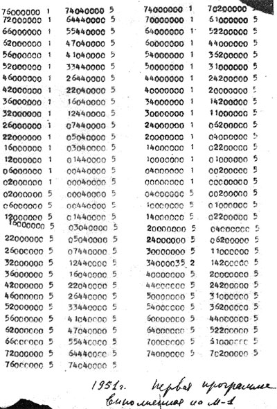
	    <figcaption>Slika 11. Primer ispisa rezultata rada M-1. <a href="#3">[3]</a></figcaption>
	</figure>

Digitalni računar M-1 koristio se za najrazličitije proračune, razvoj tehnologije programiranja, a takođe su njegovim korišćenjem rešavani mnogi naučni problemi u interesu laboratorije elektrosistema i drugih laboratorija Instituta energetike. Naučnici i inženjeri koji su do tada svoje probleme rešavali na računskom stolu ili mehaničkom integratoru, prelazili su sada na proračune realizovane računarom M-1. Na taj način je spontano formirana grupa programera sačinjena od iskusnih korisnika M-1, koja je obuhvatala specijaliste moskovskog gradskog energetskog preduzeća (_Мосэнерго_) i naučnike zaposlene u laboratoriji elektrosistema koji su zajedno proizvodili proračune režima rada gradskih električnih mreža, zatim naučnike Laboratorije za termotehniku "A. S. Predvoditeljev" (_А. С. Предводителев_) koji su počeli sa izradom prvih proračuna zagrevanja balističkih raketa pri letu kroz atmosferu, te saradnike Projektantskog biroa "Sergej Pavlović Koroljov" (_Сергей Павлович Королёв_), koji su tabele sa rezultatima proračuna parametara vazduha iza udarnog talasa smesta predavali projektantima sa ciljem određivanja neophodne količine termo-zaštitnog materijala rakete.

M-1 je takođe korišćen za rešavanje drugih velikih naučnih problema od strane nezavisnih organizacija, gde je među prvim takvim korisnicima bio akademik Sergej Soboljev koji je učestvovao i u samom razvoju računara, a koji je u to vreme bio zamenik za naučni rad u institutu akademika Igora Vasiljevića Kurčatova (_Игорь Васильевич Курчатов_, "otac" sovjetske atomske bombe). Za Kurčatovljevu grupu su na M-1 izvršeni početkom 1952. proračuni inverzije visokodimenzionalnih matrica. Računar M-1 bio je eksploatisan oko tri godine, najintenzivnije od januara 1952. do leta 1954. godine kada je u rad pušten njegov naslednik elektronski računar M-2 (_электронно-вычислительная машина M-2_, skraćeno _ЭВМ М-2_). U navedenom periodu M-1 je bio jedini elektronski računar u SSSR-u, a takođe i jedan od prvih u svetu. [[7]](#7)

## 3 Zapadni računari od kraja Drugog svetskog rata do 1952. godine

Tokom kasnih 1940-ih i ranih 1950-ih, u istom periodu kada se razvijao sovjetski računar АЦВМ М-1, zapadni svet je bio svedok revolucionarne transformacije u oblasti računarstva. Ovo doba označilo je prelazak sa teorijskih koncepata računarstva na praktičnu realizaciju elektronskih računara. Preovlađujuća tehnologija koja je pokretala ovu revoluciju bila je vakuumska cev, uređaj koji je pojačavao električne signale i omogućavao obradu složenih proračuna brzinom bez presedana.

Vakumske cevi, prvobitno razvijene za radio tehnologiju, postale su osnovne komponente ranih elektronskih računara. Ovi računari su predstavljali seizmički pomak u odnosu na ranije mehaničke računarske uređaje, kao što su analitička mašina Čarlsa Bebidža (_Charles Babbage_) i druge mašine zasnovane na bušenim karticama. Elektronski računari ove ere bili su sposobni da izvode proračune pri brzinama koje su bile nezamislive sa mehaničkim uređajima.

Upotreba vakuumskih cevi u računarstvu donela je nekoliko ključnih napretka. Prvo, omogućio je izgradnju prvih digitalnih računara opšte namene, mašina koje su se mogle programirati za obavljanje niza zadataka, što je oštar kontrast u odnosu na njihove mehaničke prethodnike koji su tipično dizajnirani za specifične proračune. Drugo, ova tehnologija je omogućila skladištenje i brzu obradu velikih količina podataka, postavljajući temelje za razvoj naprednijih računarskih sistema.

Pred ovim ranim računarima stajao je ipak i niz izazova. Bili su ogromni, često zauzimajući čitave prostorije i trošili su ogromne količine električne energije. Rani računari su takođe stvarali mnogo toplote i bili su skloni čestim kvarovima zbog ograničene pouzdanosti vakuumskih cevi. Uprkos ovim nedostacima, ove mašine su bile instrumentalne u različitim oblastima, uključujući naučna istraživanja, vojne operacije, a kasnije i u komercijalnim scenarijima.

Razvoj АЦВМ М-1 u Sovjetskom Savezu tokom ovog perioda odvijao se paralelno sa ovim značajnim napretkom na Zapadu. Bilo je ovo još jedna u nizu utakmica u globalnoj trci za tehnološkim inovacijama tokom ere posle Drugog svetskog rata, gde je računarska tehnologija brzo evoluirala i postala ključno sredstvo u različitim sektorima. Ovaj period je postavio pozornicu za budućnost računarstva, na kraju dovodeći do razvoja tranzistora i integrisanih kola, što je dovelo do nove revolucije u ovoj oblasti i utrlo put računarima savremenog doba. [[8]](#8)

U nastavku biće dat kratak pregled pet najznačajnijih zapadnih računara izgrađenih u SAD i Ujedinjenom kraljevstvu u periodu od kraja Drugog svetskog rata do momenta kada je sovjetski računar M-1 zamenjen moćnijim M-2.

### 3.1 ENIAC

ENIAC (_Electronic Numerical Integrator and Computer_), završen 1945. godine, bio je revolucionaran elektronski računar opšte namene. Razvijen od strane Džona Adama Prespera Ekerta Mlađeg (_John Adam Presper Eckert Jr._) i Džona Moklija (_John Mauchly_) na Univerzitetu u Pensilvaniji (_University of Pennsylvania_), prvobitno je dizajniran za artiljerijske tablice gađanja za američku vojsku koja je i finansirala njegov razvoj i izgradnju.

Arhitektonski, ENIAC je bio modularan računar, sastavljen od pojedinačnih panela koji su obavljali različite funkcije povezanih fleksibilnim sistemom električnih kablova. Sastojao se od 20 akumulatora za aritmetičke operacije, koji su služili i kao računarske i kao memorijske jedinice, kao i drugih specijalizovanih jedinica poput brzog množioca, delioca i koreničara. Ovi moduli su radili zajedno preko opštih sabirnica, omogućavajući računaru da izvodi proračune bez pokretnih delova, što ga čini svestranim i efikasnim u obradi. Interni kapacitet memorije ENIAC-a bio je ograničen na 20 brojeva.

ENIAC je bio težak više od 27 tona i, sa dimenzijama od 2x1x300 metara, zauzimao je površinu od 28m2. Sadržao je za to vreme neverovatan broj komponenti, uključujući 18.000 vakuumskih cevi, 7.200 kristalnih dioda, 1.500 releja, 70.000 otpornika, 10.000 kondenzatora i otprilike 5.000.000 ručno lemljenih spojeva, doprinoseći njegovoj značajnoj veličini, težini i potrošnji energije. Uprkos operativnim izazovima, uključujući česte kvarove cevi, ENIAC je predstavljao monumentalni korak u računarstvu, sa svojom sposobnošću da izvodi hiljade operacija u sekundi i rukovanje složenim sekvencama poput petlji i grana.

Programiranje ENIAC-a nije bilo interno uskladišteno već je ručno konfigurisano koristeći ploče sa utičnicama i prekidače. Ovaj proces postavljanja bio je složen i dugotrajan, ali je pružao fleksibilnost za rešavanje širokog spektra problema. Budući da je koristio vakuumske cevi za logiku i memoriju bio je značajno brži od njegovih mehaničkih prethodnika, ali su ga upravo ove karakteristike učinile fizički ogromnim potrošačem velike količine električne energije. [[9]](#9)

Unos podataka bio je moguć pomoću _IBM_-ovog čitača kartica, dok je za izvoz podataka korišćen _IBM_-ov uređaj za bušenje kartica, koje je bilo moguće proizvesti i _offline_ korišćenjem neke od _IBM_-ovih računovodstvenih mašina poput _IBM 405_. Tek osam godina kasnije ENIAC-u je dodata memorija sa magnetnim jezgrom kapaciteta 100 reči koju je izradila kompanija _Burroughs Corporation_ i time zamenila čuvanje izlaznih podataka na karticama. [[10]](#10)

Računar je koristio decimalne brojeve i nije imao koncept fiksnog ili pokretnog zareza u aritmetici. Aritmetičke operacije su izvođene paralelno, a rezultati su se prenosili između jedinica kroz sistem sastavljen od metalnih tacni i kablova. Ovaj sistem je bio preteča današnjeg sistema sabirnice u računarima.

Uticaj ENIAC-a bio je dubok. Bio je instrumentalni u proračunima za hidrogensku bombu i drugim naučnim istraživanjima, a takođe je i jedan od razloga za popularizaciju Monte Karlo metoda u nauci. Njegov razvoj označio je početak ere računara i postavio temelje za budući dizajn računara, vodeći prelazak od elektromehaničkog ka elektronskom računanju. Uprkos svojim ograničenjima, ENIAC je demonstrirao potencijal i snagu elektronskog računanja i inspirisao je naredne generacije računara. [[9]](#9)

### 3.2 EDSAC

EDSAC (_Electronic Delay Storage Automatic Calculator_), prvi put operativan početkom 1949. godine, predstavljao je značajan napredak u ranom računarstvu. Razvijen na Univerzitetu u Kembridžu (_University of Cambridge_) pod vodstvom Ser Morisa Vilksa (_Sir Maurice Wilkes_), EDSAC je bio jedan od prvih računara koji je koristio koncept memorije sa uskladištenim programom.

Fizički, EDSAC je koristio 9-inčne cevi za praćenje, kao i čitač petošupljinske trake i teleprinter kompanije Creed. Memorijski sistem se sastojao od linija kašnjenja na bazi žive, a logika je izvedena pomoću smanjene snage vakuumskih cevi, pri čemu je potrošnja energije iznosila 11 kW. EDSAC je imao ciklus vremena od 1,5 ms za većinu instrukcija i 6 ms za množenje. [[11]](#11)

Inicijalno, registri su bili ograničeni na akumulator i registar množioca. Akumulator je bio dvostruko duži registar povezan sa sabiračem, što je omogućavalo sabiranje ili oduzimanje brojeva preuzetih iz memorije sa brojem koji se već nalazio u akumulatoru. Ovaj dizajn je osigurao da ne dođe do gubitka cifara prilikom množenja dva broja od 35 bita i njihovog dodavanja akumulatoru. Akumulator je mogao da obrađuje neograničena sabiranja ili proizvode brojeva, uz mere opreza kako bi se izbeglo prekoračenje. Takođe, EDSAC je imao instrukcije za pomeranje brojeva u akumulatoru, množenje ili deljenje brojeva stepenima broja dva, i ispravno zaokruživanje brojeva. EDSAC nije imao instrukciju za deljenje, pa se za tu svrhu koristio potprogram. [[12]](#12)

David Wheeler je 1953. godine, nakon boravka na Univerzitetu u Ilinoisu, dizajnirao indeksni registar kao proširenje originalne EDSAC opreme. Iako je magnetofonski pogon dodat 1952. godine, on nikada nije zadovoljavajuće funkcionisao. Glavna memorija EDSAC-a inicijalno je imala samo 512 reči od 18 bita, a nije postojala sekundarna memorija. Potpuna memorija od 1024 reči postala je dostupna tek 1955. ili početkom 1956. godine.

Što se tiče programiranja, EDSAC je koristio dvojni komplementarni binarni sistem, a brojevi su bili ili 17-bitni (jedna reč) ili 35-bitni (dve reči). Posebno je bilo zanimljivo da je množilac tretirao brojeve kao fiksno-pozicionirane frakcije u opsegu −1 ≤ x < 1, odnosno da je binarna tačka bila odmah desno od znaka. Instrukcije koje su bile dostupne uključivale su sabiranje, oduzimanje, množenje i sabiranje, logičko AND i sabiranje, pomak ulevo, aritmetički pomak udesno, učitavanje registra množioca, čuvanje (i po potrebi brisanje) akumulatora, uslovni skok, čitanje ulazne trake, štampanje karaktera, zaokruživanje akumulatora, No-op, i zaustavljanje.

Maurice Wilkes je diskutovao o relativnim adresnim modusima za EDSAC u radu objavljenom 1953. godine, kako bi olakšao korišćenje potprograma.

EDSAC se koristio za rešavanje stvarnih problema i razvoj mnogih ranih tehnika koje su sada uključene u operativne sisteme. Korisnici su pripremali svoje programe tako što su ih bušili na papirnoj traci. Kada je program bio spreman, kačio se na konopac pored čitača trake. Mašinski operateri bi birali sledeću traku iz reda i učitavali je u EDSAC.

EDSAC je bio specifično dizajniran kao deo podrške Matematičkog laboratorija za proračune. Prvi naučni rad objavljen uz pomoć računara za proračune bio je rad Ronalda Fishera. Wilkes i Wheeler su koristili EDSAC za rešavanje diferencijalne jednačine vezane za učestalosti gena. [[11]](#11)

Pored svega navedenog, EDSAC računar se takođe smatra i kolevkom video-igara. Godine 1952. Sendi Daglas (_Sandy Douglas_) je razvio _OXO_, verziju "Iks-Oks" igre za EDSAC, sa grafičkim izlazom na VCR97 6-inčnu katodnu cev. Daglasov primer sledio je Stenli Gil (_Stanley Gill_) koji je kreirao igru koja je uključivala tačku (koja je predstavljala "ovcu") i koja se približavala liniji na ekranu u kojoj se može otvoriti jedna od dve kapije. Igrač je sa računarom interahovao korišćenjem svetlosnog snopa EDSAC-ovog čitača papirne trake, i to tako što, ako bi bio prekinut (npr. prekrivanjem rukom) otvorila bi se gornja kapija, inače bi se otvorila donja. [[13]](#13)

### 3.3 UNIVAC I

UNIVAC I (_Universal Automatic Computer I_) je bio prvi elektronski digitalni računar opšte namene dizajniran za poslovnu primenu koji je proizveden u Sjedinjenim Američkim Državama. Projektom dizajniranja UNIVAC I računara rukovodili su Džon Presper Ekert i Džon Mokli, tvorci ENIAC-a. Rad na računaru je započela Ekertova i Moklijeva kompanija _Eckert-Mauchli Computer Corporation_ (skraćeno _EMCC_), a uređaj je završen nakon što je kompaniju kupila kompanija*Remington Rand* (koja je kasnije postala deo _Sperry_-ja, danas _Unisys_).

Dizajniran za poslovnu i administrativnu upotrebu, UNIVAC I je predstavljao odstupanje od kompleksnih numeričkih proračuna naučnih računara, fokusirajući se na jednostavne aritmetičke i operacije sa podacima. U početku, njegova nesposobnost da čita ili buši kartice ograničila je njegovu privlačnost, što je kasnije rešeno dodatkom opreme za _offline_ obradu kartica. Uprkos manjoj tržišnoj prodaji u početku, UNIVAC I stekao je slavu tačno predviđajući ubedljivu pobedu Ajzenhauera na predsedničkim izborima 1952. godine, što je znatno povećalo javnu svest o računarskoj tehnologiji i učinilo računarska predviđanja standardnim delom izbornih emisija. Prva prodaja UNIVAC-a I bila je uglavnom državnim agencijama, pri čemu je prva instalacija bila u Pentagonu 1952. godine nakon početne prodaje Birou za popis. [[14]](#14)

UNIVAC I se sastojao od 6,103 vakuumske cevi, bio je težak preko 7 tona, i zahtevao je 125kW električne energije. Što se hardverskih specifikacije tiče, uključivao je CPU sa taktom od 2.25 MHz i dupleksnu aritmetičku jedinicu za detekciju grešaka. Sastojao se od hiljadu reči memorije realizovane kroz sto živinih linija kašnjenja (eng. _mercury delay lines_), svaka sa 10 reči, i više CPU registara. Takođe, imao je dva 60-rečna bafera, jedan za čitanje trake i drugi za pisanje na traku. Reč u ovom sistemu mogla je sadržati 12 alfanumeričkih karaktera, 11-cifreni operand sa znakom ili dve instrukcije.

Karakteri su bili kodirani sa šest bita i dodatnim bitom za proveru pariteta. Optimalno vreme za sabiranje bilo je oko pola milisekunde. Za pomoćnu memoriju, sistem je bio opremljen sa osam magnetnih traka poznatih kao Uniservos, sposobnih za različite operacije čitanja i pisanja, uključujući čitanje unazad i brzo premotavanje. Metalna traka bila je široka pola inča, a na kolutu od 1500 stopa moglo se snimiti oko 1.5 miliona karaktera. Dizajn sistema omogućavao je paralelno procesiranje, što je CPU-u omogućavalo da preklapa operacije čitanja, pisanja i aritmetičke operacije. _Offline_ uređaji za trake omogućavali su unos sa tastature na traku i ispis na električnoj pisaćoj mašini, pri čemu su Uniservosi mogli čitati ili pisati ove posebne trake.

UNIVAC I nije imao operativni sistem, što je od operatera zahtevalo da ručno učitavaju programe i podatke. Zabrinutost oko pouzdanosti digitalnog logičkog kola dovela je do inovativnih izbora dizajna i praksi održavanja, doprinoseći njegovom relativno stabilnom radu uprkos izazovima rane računarske tehnologije. [[15]](#15)

### 3.4 Manchester Mark 1

Autor računara Manchester Mark 1 Frederik Vilijams (_Frederic C. Williams_) je do 1946. godine radio već sedam godina u Telekomunikacionom istraživačkom institutu (_Telecommunications Research Establishment_, skraćeno _TRE_), gde je predvodio tim specijalizovan za rešavanje problema u radarima i elektronici za vazduhoplovstvo. Tokom posete SAD-u u julu 1946. godine, shvatio je da je elektronsko digitalno skladištenje podataka ključni izazov u razvoju elektronskih računara. Po povratku, započeo je istraživanje skladištenja digitalnih informacija koristeći konvencionalnu radarsku katodnu cev (_cathode ray tube_, skraćeno _CRT_) i do novembra iste godine uspešno je uskladištio jedan bit informacija.

U decembru je Vilijams prešao na Univerzitet u Mančesteru (_University of Manchester_) kao profesor na Departmanu za elektroinženjerstvo. Sa sobom je poveo dvojicu kolega sa _TRE_-a, od kojih je jedan bio Tom Kilbern (_Tom Kilburn_), kako bi nastavili započeta istraživanja.

Do oktobra 1947. godine grupa je razvila sistem za skladištenje 2048 bita na standardnoj katodnoj cevi. Mehanizam je koristio matricu dimenzija 64x32 fosforna naboja na ekranu, od kojih je svaki postavljen na jedan od dva različita načina, predstavljajući tako ili 0 ili 1. Međutim, problem je predstavljalo gubljenje naboja za svega 0,2 sekunde, što je rešeno postavljanjem detektora ispred _CRT_-a zajedno sa mehanizmom čiji je zadatak bio da kontinualno prelazi preko svih ćelija matrice elektronskim snopom, čime bi se vrsta naboja na svakoj pozicija mogla detektovati i osvežiti, što je kao posledicu imalo održavanje naboja u matrici. Resetovanje pojedinih bitova i čitanje vrednosti moglo se takođe preplitati s mehanizmom osvežavanja.

Do juna 1948. godine, grupa naučnika je izgradila Malu eksperimentalnu mašinu (_Small Scale Experimental Machine_, skraćeno _SSEM_) prema dizajnu Toma Kilberna, poznatu i kao Beba (_Baby_). Zadatak ovog uređaja bio je pre svega test da li će CRT memorija i dalje efikasno raditi na brzinama koje zahteva računar željenih specifikacija.

SSEM je imao samo glavnu memoriju od 32x32-bitne reči i koristio je jednu CRT. Drugi dostupan CRT bio je namenjen samo držanju 32-bitnog akumulatora, dok je treći sadržao adresu trenutne instrukcije kao i samu instrukciju. Četvrti CRT bio je bez mehanizma za skladištenje i postavljen na konzoli, te je mogao da bude podešen tako da prikaže kopiju trenutnog bitnog obrasca na bilo kojoj od skladišnih cevi, odnosno vršio je funkciju izlaznog uređaja. Ulaz je ostvaren kroz tastaturu od 32 dugmeta ne računajući ručne prekidače, kojom se mogao postaviti bilo koji bitni obrazac u bilo kojoj reči.

Oktobra 1948. godine doneta je odluka da se izgradi računar punih dimenzija u Departmanu za elektroinženjerstvo. Budući da je Kilbern i ovog puta bio odgovoran za dizajn, osnovna arhitektura oslanjala se na iskustvo ostvareno tokom razvoja SSEM računara. Grupa saradnika je proširena, te je sada uključivala Daja Edvardsa (_Dai Edwards_) zaduženog za CRT skladištenje i CPU, Aleka Robinsona (_Alec Robinson_) koji se od juna 1947. bavio množiteljem, G. E. Tomas (_G. E. Thomas_) čiji je zadatak bio doboš, i Džef Tutil (_Geoff Tootill_) koji je bio generalista u timu još od vremena _TRE_-a. Konačno, od strane vlade Ujedinjenog kraljevstva angažovana je kompanija _Ferranti Ltd._ koja je trebala da izgradi komercijalnu varijantu računara zasnovanu na rezultatima razvoja.

Završen računar nazvan je Manchester Mark 1 i u odnosu na SSEM i osnovnu fon Nojmanovu arhitekturu odlikovao se dvema značajnim karakteristikama: brzom memorijom na dva nivoa, i registrima modifikacije registara (tzv. B-linije).

Opšte prihvaćeno mišljenje u to vreme bilo je da je potrebno da računar ima nekoliko hiljada reči glavne memorije kako bi bio prigodan za opštu primenu. Iako izgradnja takve memorije nije bila neizvodljiva, iz razloga štednje grupa se odlučila za dodavanje memorijskog skladišta u vidu magnetnog doboša koji je rotirao sinhronizovano sa brzinom skeniranja, čime se prenos čitanja koji resetuje CRT završavao u jednom obrtu.

Druga inovacija bilo je uvođenje B-cevi koja sadrži dva posebna registra od 20 bita (odnosno osam u _Ferranti_-jevim mašinama što se pokazalo kao korisnije), nazvana "B-linije". Svaka instrukcija sadržala je polje koje je određivalo jednu od B-linija, i čim je sledeća instrukcija preuzeta iz memorije, sadržaj B-linije se dodavao instrukciji pre nego što je bila u potpunosti dekodirana i izvršena. Sadržaj B0 se po konvenciji uvek držao na 0, tako da se B0 koristio gde god modifikacija nije bila potrebna. Prava pogodnost ovog dodatka bila je u modifikaciji adresa instrukcija; ovo je ubrzo postalo osnovna sposobnost većine računara, pri čemu se modifikacija ograničavala na adresu operanda u instrukciji. Ovo je klasično olakšavalo pristup opštim podacima, na primer (a) pristup elementu niza fiksne pozicije, gde _F_ daje osnovu niza a _V_ indeks, i (b) pristup skalaru u zapisu ili steku, gde _V_ daje osnovu zapisa/steka a _F_ relativnu adresu skalara. Naravno, kako se veličina memorije povećava, B-linije omogućavaju pristup adresama memorije izvan opsega koji može biti određen adresnim poljem instrukcije. Stoga, B-linije predstavljaju, kako su korišćene, ono što bismo danas nazvali "indeksni registri".

Manchester Mark 1 bio je operativan oktobra 1949. godine, sa glavnom memorijom od 128 reči od 40 bita i kapacitetom magnetnog bubnja koji je nastavio da raste do oko 3.000 reči. Međutim, Srednja verzija (_Intermediate Version_) bila je dostupna za opštu upotrebu drugih odeljenja i kompaniju _Ferranti_ tek od aprila 1949. godine. U to vreme je zabeleženo da je Mark 1 uspešno završio 9-satni noćni rad na Mersenovim prostim brojevima 16. i 17. juna 1949. godine. Još uvek nije imao ulaz/izlaz putem papirne trake i programabilne transfere bubnja. Magnetni bubanj je radio, ali je kolo za uključivanje transfera u set instrukcija još uvek bilo nezavršeno, tako da su transferi vršeni intervencijom operatera nad zaustavljenim programom. Ipak, bio je neprocenjiv za čuvanje unapred pripremljenih ulaznih podataka i programa, izlaza, korisnih rutina i međuproračuna za dugotrajne programe.

Od leta 1949. godine pažnja se sve više preusmerava na prenos i unapređivanje dizajna budućeg računara Ferranti Mark 1. Prvi ovakav računar isporučen je Univerzitetu u februaru 1951. godine i imao je suštinski istu arhitekturu kao i Manchester Mark 1, s tim da su broj instrukcija, CRT, magnetna memorija i brzina rada bili znatno povećani i poboljšani. Uz redizajniran multiplikator i rekonstruisan doboš, glavna memorija je sada sadržala 256 reči od 40 bita, dok je maksimalni kapacitet doboša bio oko 16.000 reči. [[16]](#16)

### 3.5 IBM 701

Računar predstavljen javnosti 21. maja 1952. godine, čije je puno ime IBM 701 Elektronska mašina za obradu podataka bio je _IBM_-ov prvi komercijalni naučni računar kao i njihov prvi serijski proizvedeni mejnfrejm (eng. _mainframe_) računar. Razvijen je od strane Džeriera Hadada (_Jerrier Haddad_) i Natanijela Ročestera (_Nathaniel Rochester_) na osnovi _IAS_-ovog računara (_Institute for Advanced Study_) u Prinstonu. [[17]](#17)

_IBM_ 701 bio je paralelan binarni računar prvenstveno namenjen rešavanju velikih problema u nauci i inženjerstvu. Reč je o prvom sistemu tog tipa koji je serijski proizveden u velikim količinama. Računar se kontrolisao uskladištenim programom sačinjenim od jednoadresnih instrukcija. Imao je veliku internu memoriju velike brzine, čak i u poređenju sa uređajima koji su mu prethodili. Ovakav skladišni prostor je dopunjen sporijom magnetnom memorijom na principu magnetnog doboša, kao i magnetnom trakom, koji su oba imali veći kapacitet od brze memorije. Postojao je kompletan set ulazno/izlaznih komponenti u sistemu, uključujući bušene kartice i linijski štampač, kao i magnetne trake, i sve to pod direktnom kontrolom računarskog programa. Broj takvih ulazno/izlaznih uređaja je mogao da varira kako bi se prilagodio zahtevima pojedinačnih korisnika.

Aritmetička brzina računara 701 bila je uporediva sa brzinom drugih brzih računara tog vremena. Ipak, kod 701 velika brzina bila je kombinovana sa velikim skladišnim kapacitetima i brzim ulazom, odnosno izlazom. Stoga, kod velikih problema koji zahtevaju dopunu internog kapaciteta eksternim uređajima, ovaj računar je mogao da proizvede rezultate brže nego bilo koji računar do tada sagrađen. Ova činjenica ne iznenađuje kada se ima na umu da je 701 specifično dizajniran da izlazi na kraj sa problemima koji izlaze van granica mogućnosti postojećih računara. S druge strane, svestranost ulazno/izlaznih opcija dozvoljavala je da se 701 koristi i za male probleme koji se javljaju u velikim količinama, u čemu je takođe pomagala centralna kontrola periferalija od strane računara. [[18]](#18)

Sa ciljem smanjenja složenosti hardvera aritmetika sa pokretnim zarezom, prevođenje između binarnog i decimalnog i indeksiranje su prepušteni programeru. Osmišljena je instrukcija _COPY_ kako bi se omogućilo programeru da kontroliše ulazno/izlaznu opremu do detalja, čime se izbegava potreba za mnogo složenijim hardverom. Jedan poziv _COPY_ instrukcije mogao je da pročita jednu binarnu reč (od kojih svaka sadrži dve instrukcije) iz jednog reda kartice. Tako je bilo moguće napisati program za pokretanje koji je ukucan na kartici, što bi omogućilo programu da samog sebe učita u računar i inicijalizuje ga kako bi mogao da čita dalje programe. [[17]](#17)

## 4 Zaveštanje sovjetskog računarstva danas

Računar M-1 bio je mnogo manji od _ENIAC_-a, što ne iznenađuje budući da je potonji u trenutku završetka M-1 bio već 7 godina star. Proces smanjivanja komponenata je do 1952. na zapadu značajno odmakao, tako da je _IBM_-ov 701 već bio značajno manji od M-1. Uzevši u obzir ostale tehničke karakteristike, M-1 je uopšteno govoreći bio uporediv sa starijim zapadnim računarima, dok je zaostajao za tada savremenim uradcima poput _IBM_ 701. Međutim, značaj M-1 i kasnijeg _БЭСМ_ računara Sergeja Lebedeva (rus. _быстродействующая электронная счетная машина_, brza elektronska računska mašina) je u činjenici da su postavili osnove autohtone sovjetske škole izgradnje digitalnih računara koji će ubrzo dostići zapadne mašine po performansama, a izvedene od delova dostupnih u uslovima uništene privrede i opšte nestašice.

Tokom 1960-ih i 1970-ih godina došlo je do otopljavanja odnosa između zapada i Sovjetskog saveza, i u ovom periodu dolazi do intenzivnih kontakata prvaka ruskog računarstva sa predstavnicima zapadne industrije, pre svega IBM-a. Vrhunac ove saradnje trebala je da bude saradnja na unapređenju sovjetskog računara ЕС ЭВМ (unifikovan sistem elektronskih računara, rus. Единая система электронных вычислительных машин), koji je bio svojevrsni pandan legendarnom _IBM_-ovom OS/360 računaru. _IBM_ je formalno izrazio zainteresovanost za razvoj jedne od verzija ЕС ЭВМ između 1974. i 1976. godine, ali do saradnje ipak nije došlo zbog sankcija uvedenih zbog ulaska sovjetske vojske u Afganistan 1979. godine.

Nakon toga sovjetska industrija izgradnje računara beleži pad. Računar ЕС ЭВМ je bio u proizvodnji i upotrebi u zemljama socijalističkog bloka od 1968. do 1998. godine kao čisto sovjetski autorski rad. Nakon pada socijalizma, sve istočne zemlje, uključujući i samu Rusiju takoreći "zvanično" su prešle na IBM kompatibilne računare i kasnije drugi na zapadu proizveden hardver i softver.

Ipak, uprkos katastrofalnom padu i raspadu tokom 1990-ih godina, savremena Rusija nije odbacila autohtonu računarsku industriju. Najpoznatiji ruski procesor danas pripada seriji Elbrus CPU-ova (_Эльбрус_), čiji je prvi primerak proizveden 1979. godine u sovjetskom savezu. U periodu pre 2010-ih računari na bazi Elbrus procesora prvenstveno su se izrađivali na Institutu precizne mehanike i računarske tehnike "S. A. Lebedev" (_Институт точной механики и вычислительной техники имени С. А. Лебедева РАН_) kao vojni poljski laptopi ili kao jedinice namenjene upotrebi od strane Roskosmosa (Državna korporacija za kosmičku delatnost "Roskosmos", Государственная корпорация по космической деятельности "Роскосмос"). Danas pak, u uslovima najžešćih zapadnih sankcija u istoriji zemlje, rusko tržište se okreće sopstvenim proizvodnim kapacitetima te se od 2022. godine u ponudi omske kompanije _BITBLAZE_ mogu pronaći potrošački laptop računari sa Elbrus procesorima i ostalim hardverom koji je u potpunosti proizveden u Rusiji. Na računare je moguće instalirati kako Linux tako i Windows operativni sistem, a tokom demonstracije prikazane su različite savremene video igre sa zavidnom količinom detalja.

## Literatura

<a id="1">[1]</a> Minina E, Platonova M. (2018, March 20-21) Lukyanov’s Hydraulic Integrator and Moor’s Hydrocal: Experience in Applying of the Hydraulic Analogies Method in the USSR and the USA [Paper presentation]. 2018 International Conference on Engineering Technologies and Computer Science (EnT), Moscow, Russia. URL: https://ieeexplore.ieee.org/xpl/conhome/8419341/proceeding

<a id="2">[2]</a> Prokhorov, S. P. Computers in Russia: science, education, and industry. IEEE Annals of the History of Computing. 1999 July-September;21(3):4–15

<a id="3">[3]</a> Муравьев С A, составитель. Отечественная электронная вычислительная техника. Издательский дом Столичная энциклопедия, Москва: 2014

<a id="4">[4]</a> Кравец С Л, ответственный редактор. Большая российская энциклопедия. Большая российская энциклопедия, Москва: 2004-2017

<a id="5">[5]</a> Пройдаков Э М, составитель. Страницы истории отечественных ИТ. Альпина паблишер, Москва: 2015

<a id="6">[6]</a> Eremenko, A. (2021, May 20) Unique and forgotten: the birth of the Soviet missile defense system. Brooke and M-1. TopWar. https://en.topwar.ru/182774-unikalnaja-i-zabytaja-rozhdenie-sovetskoj-pro-chast-iii-bruk-i-m-1.html

<a id="7">[7]</a> Alexandridi T M, Rogachov U V. (2006, July 3-7) Automatic Digital Computer M-1 of the I.S. Brook Laboratory [Paper presentation]. 1st Soviet and Russian Computing (SoRuCom), Petrozavodsk, Russia. URL: https://dblp.org/db/conf/ifip9/sorucom2006.html

<a id="8">[8]</a> Copeland, J. The Modern History of Computing. In: Zalta E N, editor. The Stanford Encyclopedia of Philosophy, Winter 2017 Edition. Stanford: Metaphysics Research Lab Philosophy; 2017. URL: https://plato.stanford.edu/archives/win2020/entries/computing-history

<a id="9">[9]</a> Burks A W, Burks A R. First General-Purpose Electronic Computer. Annals of the History of Computing. 1981 October-December;3(4):310-389

<a id="10">[10]</a> Goldstine H H, Goldstine A. The electronic numerical integrator and computer (ENIAC). IEEE Annals of the History of Computing. 1996, April-June;18(1):10-16

<a id="11">[11]</a> Robinson P, Spärck Jones K. EDSAC 99 Commemorative Booklet. University of Cambridge Computer Laboratory, Cambridge: 1999

<a id="12">[12]</a> Wilkes, M. V. Arithmetic on the EDSAC. IEEE Annals of the History of Computing. 1997 January-March;19(1):13-15

<a id="13">[13]</a> Smith, A. R. The Dawn of Digital Light. IEEE Annals of the History of Computing. 2016 October-December;38(4):74-91

<a id="14">[14]</a> Lukoff, H. From Dits to Bits: A personal history of the electronic computer. Robotics Press, Portland (Oregon): 1979

<a id="15">[15]</a> Johnson, L. R. Coming to Grips with Univac. IEEE Annals of the History of Computing. 2006 April-June;28(2):32-42

<a id="16">[16]</a> Napper, R. B. E. The Manchester Mark 1 Computers. In: Rojas R, Hashagen U (editors). The First Computers: History and Architectures. Cambridge: MIT Press; 2000. URL: https://mitpress.mit.edu/9780262681377/the-first-computers/

<a id="17">[17]</a> Rochester, N. The 701 Project as Seen by Its Chief Architect. IEEE Annals of the History of Computing. 1983 April-June;5(2):115-117

<a id="18">[18]</a> Buchholz, W. The System Design of the IBM Type 701 Computer. Proceedings of the IRE. 1953 October;41(10):1262-1275

[^1]: Veliki otadžbinski rat je osnovni deo Drugog svetskog rata i obuhvata sukob Saveza sovjetskih socijalističkih republika sa Trećim rajhom i njemu pridruženim satelitskim državama.
[^2]: Oznake sastavnih komponenti računara u tekstu su date u originalu, odnosno zapisane su ruskim ćiriličnim pismom.
[^3]: Lokalni softverski senzor (_местный программный датчик_, skraćeno _МПД_) iz glavnog softverskog senzora (_главный программный датчик_, skraćeno _ГПД_) prima jedan od četiri moguća impulsa, koji ukazuje na to kakvu akciju je potrebno izvršiti nad brojevima preuzetim iz registara A, B i C. Nakon kraja dejstva lokalni softverski senzor prosleđuje rezultate u softversko-digitalnu magistralu (_программно-цифровая магистраль_, skraćeno _ПЦМ_), istovremeno šaljući u glavni senzor impuls kojim ga izveštava o kraju operacije.
